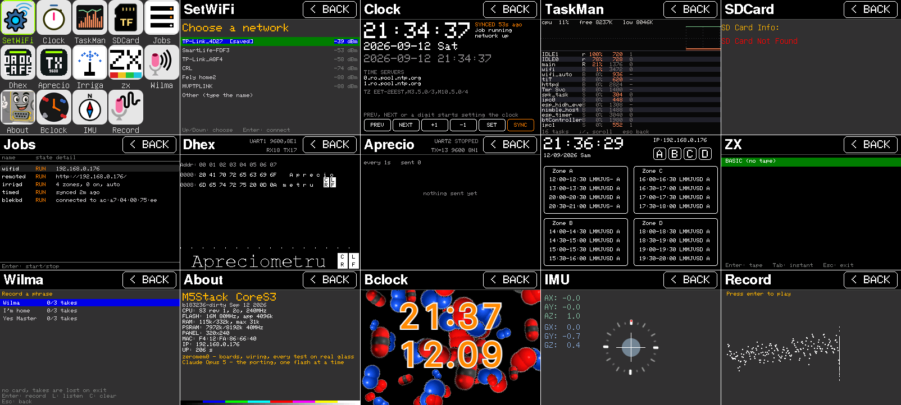

# CoreS3 ADV

The [Cardputer ADV](https://docs.m5stack.com/en/products/sku/K132-Adv) user
demo and the applications grown on top of it, running on an
[M5Stack CoreS3](https://docs.m5stack.com/en/core/CoreS3).

The two boards share an ESP32-S3 and very little else. The Cardputer has a
240x135 panel and a keyboard of its own; this one has a 320x240 ILI9342C
with a capacitive touch panel, an AXP2101 power chip, an AW9523B expander
and 8 MB of PSRAM, and no keys at all. What replaces the keyboard is an
[M5Stack CardKB](https://docs.m5stack.com/en/unit/cardkb_1.1) on Grove
port A.



Captured off the panel over HTTP, as is the timelapse of the same walk
through the firmware: [docs/demo.gif](docs/demo.gif), or the same film
as [mp4](docs/demo.mp4).

## Input

Everything in this firmware reads the keyboard by physical matrix position
rather than by key code, because that is how the Cardputer's own screens
were written. The CardKB is read over I2C at address 0x5F and each report
is translated into the matrix position a Cardputer user would have pressed,
with Fn or shift wrapped around it where the character needs them. Screens
poll for the latest event rather than subscribing, so events are handed out
one per frame the way a scanned matrix delivers them.

Without a CardKB the panel is the keyboard: nine invisible cells stand in
for the arrows, enter and escape, and a drawn band along the bottom carries
the whole matrix. The band is not built when a CardKB answers -- on 240
rows it would be taking room from the application under it.

A Bluetooth keyboard is the third way in, and arrives at the same place.
The `blekbd` job takes the board's radio as a BLE HID host, looks for
anything advertising the HID service, asks it to encrypt the link, and
turns the usages it sends into the same matrix positions. It is off until
started from the Jobs application, because the radio is paid for in
internal memory; once started it stays up until the board is rebooted.

The power button is the home key. `M5.BtnA` on this board is a touch zone
along the bottom of the screen, which the nine cells are already using.

## Desktop

A page of icons, opened by touching one or by walking to it with the
arrows. Fourteen applications:

| | |
|---|---|
| SetWiFi | join a network, and the list of the ones already known |
| Clock | the time, where it came from, and setting it by hand |
| TaskMan | what the scheduler is running, and what it costs |
| SDCard | what is in the slot |
| Jobs | the background services, and starting or stopping them |
| Dhex | a serial line in hex and ASCII, with a terminal under it |
| Aprecio | sends a line to a serial port on a timer |
| Irriga | watering schedules, four zones, with a clock behind them |
| ZX | a ZX Spectrum 48K, drawn pixel for pixel inside its border |
| Wilma | recognises a spoken phrase it was taught, in the voice that taught it |
| About | chip, flash, memory, address, and a colour bar that tests the panel |
| Bclock | a clock made of molecules, snowflakes or icons |
| IMU | the accelerometer and the gyroscope |
| Record | the microphone |

The board also serves a page over HTTP that mirrors the screen, types into
it and opens applications by name, and `/shot` takes a screenshot.

## Build

Dependencies are fetched into `components/`:

```bash
python3 ./fetch_repos.py
```

With PlatformIO, which brings its own ESP-IDF tree and toolchain:

```bash
pio run -e cores3_adv -t upload
```

With a standalone [ESP-IDF v5.4.2](https://docs.espressif.com/projects/esp-idf/en/v5.4.2/esp32s3/index.html)
install, `idf.py build` and `idf.py flash` work against the same sources.

### A network to start from

A board with an empty NVS joins nothing until SetWiFi is used. To have it
join one at the first boot instead, copy `main/wifi_credentials.h.example`
to `main/wifi_credentials.h` and fill it in. The copy is ignored by git.
The entry is remembered like any other and can be removed from SetWiFi.

### A tape for the emulator

`ZX` reads `.tap` and `.z80` files from the card, and can also carry one
in the firmware. See `main/apps/app_zx/assets/builtin_tape.h.example`;
none is shipped here, since the Spectrum games worth playing are still
under copyright.

## What is not here

Remote and StringIR drive an infrared LED this board does not carry, and
Keyboard forwards a matrix that is not here either. Scan was folded into
SetWiFi. The REPL and the PikaScript interpreter under it were dropped.
ZX Ext is left out by choice.

Several screens are still laid out for the Cardputer's 240x135 and have
room to spare here.

One thing worth knowing about the card slot: GPIO35 is the panel's
data/command line and the card's MISO at the same time. The two are never
driven at once and the card reads fine -- SDCard reports it and ZX loads
tapes off it -- but it is the first place to look if either ever
misbehaves while the other is busy.

## Acknowledgments

This project references the following open-source libraries and resources:

- https://github.com/m5stack/M5GFX.git
- https://github.com/m5stack/M5Unified.git
- https://github.com/Forairaaaaa/mooncake
- https://github.com/Forairaaaaa/mooncake_log
- https://github.com/Forairaaaaa/smooth_ui_toolkit
- https://github.com/adafruit/Adafruit_TCA8418
- https://github.com/raysan5/raylib
- https://github.com/hhuysqt/esp32s3-keyboard
- https://github.com/78/xiaozhi-esp32
- The ZX Spectrum core comes from AndyAiCardputer, MIT licensed.
